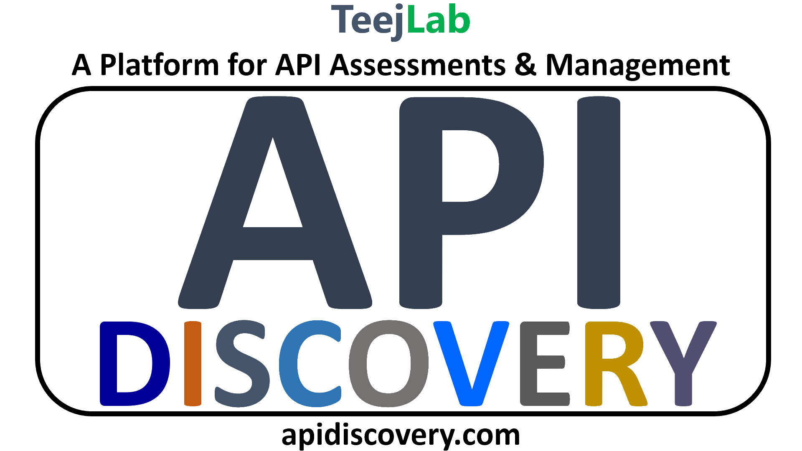

If you haven't already, sign up with this link: [bit.ly/uoacrypto](https://bit.ly/uoacrypto)!

Make sure to also join our [Facebook group](https://www.facebook.com/groups/777939186010323/)!

# Leaderboard

Rounds 1 and 2 have ended, and so we can now show everyone who's at the lead! Keep in mind that Round 3 has **far more** points (66) than Round 1 (10) and 2 (26) **combined**, and as long as you have earned 36 points by the end of the challenge, you will have a chance to win a prize!

You can take a look at the responsive version of the leaderboard **[here](https://crypto-challenge-points-chart.now.sh/)** (scores of 10 points or lower were not included).

*Remember, even if you won't get full points, attempting the challenges anyways for partial points will still land you in a far more advantageous position! As an example, each question in the Hard challenge form is worth at least 5 points!!*

# Introduction

The Cryptography Challenge is designed by University of Alberta Students to motivate others to become more interested in ciphers and encryption. The challenge is designed to be approachable from any skill level, yet offer enough difficulty to keep those with experience interested.

Make sure to check out [the Resources section](/resources) for help with any cipher used in the challenges.

Also check out the [the About page](/about) for details on how the challenge is being run!

# Story

## Backstory

These challenges follow the story of a doomed Earth, years after aliens attempted to harvest resources off of our planet but were met with nuclear war. The war destroyed all forms of modern computers and most electrical components, and so civilization was reduced to post-apocalyptic scavengers.

The aliens who survived outnumber the humans living on Earth, and appear to be communicating with their home planet using devices which resemble cell-phones. They understand the English language perfectly, yet have no concept of human culture.

It is assumed that reinforcements will soon arrive (around 3 months) to rescue the aliens and eradicate the remaining humans. Humanity must find a way to save themselves without letting the aliens catch on to what they are planning.

## Main Story

You are one of the surviving humans on Earth, who is involved in a group who is attempting to save humanity, by scouting out potential solutions to the incoming alien invasion. Since the aliens do not seem to understand the concept of encryption and secrecy, your group has decided to use basic (pre-computer) ciphers to communicate secret messages between each other.

Many members of your group have been attacked by aliens, however some have left clues to their findings as a precaution. You are to seek out and find these clues, so that you may save the human race.

# Sponsors

This challenge wouldn't be possible without the support from our sponsors:

Learn more about CompuVision here: [www.compuvision.biz](https://www.compuvision.biz)

Learn more about API Discovery here: [https://apidiscovery.com/](https://apidiscovery.com/)

